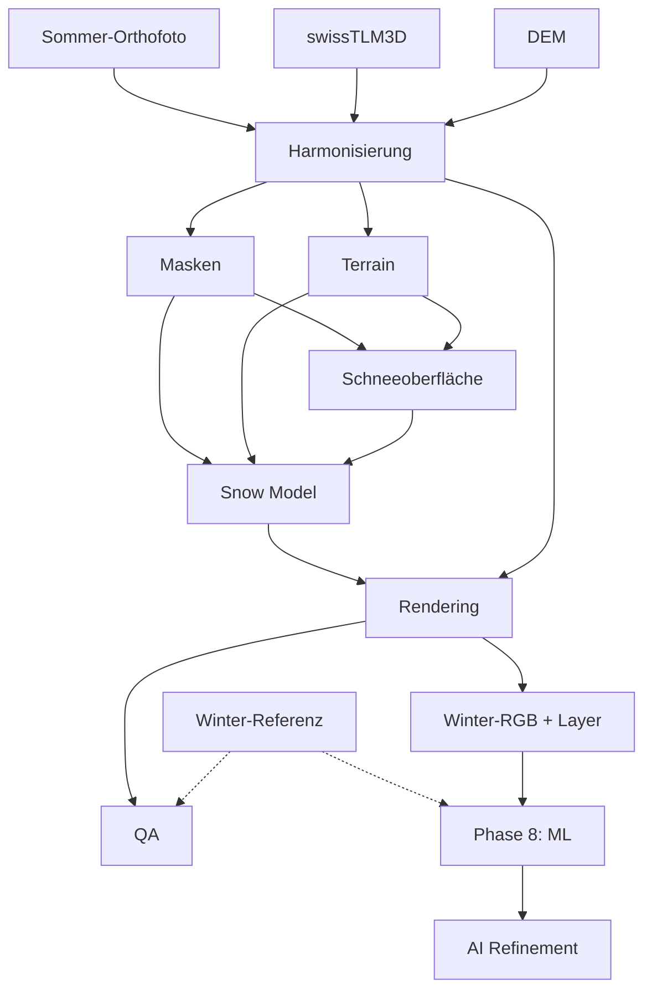

# Projekt-Roadmap

Übersicht über die Entwicklungsphasen von **wintermaker**: vom regelbasierten MVP (Stage 1) bis zum geplanten ML-Finishing (Stage 2).

Designprinzip: **Geometrie stabil halten**, alle Zwischenlayer als COG speichern, KI erst auf einem erklärbaren Regel-Output aufsetzen.

---

## Gesamtstruktur

| Stufe | Phasen | Ziel |
|-------|--------|------|
| **Stage 1** | Phase 0–7 + Erweiterungen | Deterministische, regelbasierte Pipeline |
| **Stage 2** | Phase 8+ | ML-Kalibrierung und optionales KI-Finishing |



---

## Phase 0–7: MVP (regelbasiert)

Ursprünglicher Implementierungsplan beim Projektstart. Alle Phasen sind **abgeschlossen**.

| Phase | Inhalt | CLI / Module | Status |
|-------|--------|--------------|--------|
| **0** | Repository-Grundgerüst (Package, Config, CLI-Skelett) | `pyproject.toml`, `winter_ortho/`, `config/` | ✅ |
| **1** | Datenharmonisierung (Orthofoto + DEM auf gemeinsames Raster) | `harmonize`, `io/`, `preprocessing/align.py` | ✅ |
| **2** | Geometrische Masken aus swissTLM3D | `masks`, `config/class_rules.yaml` | ✅ |
| **3** | Terrain-Features (Hang, Exposition, Hillshade, TPI …) | `terrain`, `features/terrain.py` | ✅ |
| **4** | Schneebedeckungsmodell (Zwischenlayer, kein RGB) | `snow`, `snow_model/rules.py` | ✅ |
| **5** | Klassenweises Winter-Rendering | `render`, `rendering/*.py` | ✅ |
| **6** | QA (Geometrie, Plausibilität) | `qa`, `qa/geometry_checks.py` | ✅ |
| **7** | End-to-End-Orchestrierung + Notebook | `run-all`, `notebooks/01_explore_reference_images.ipynb` | ✅ |

**Akzeptanzkriterium MVP:** `winter-ortho run-all` erzeugt ein Winter-Orthofoto mit allen Zwischenlayern und einem QA-Report.

```bash
winter-ortho run-all --tile-id demo_test_001 --profile demo_test --config config/regions/demo_test.yaml
```

---

## Erweiterungen nach dem MVP (Stage 1)

Diese Arbeitsschritte waren im ursprünglichen Plan 0–7 nicht enthalten, sind aber inzwischen Teil von Stage 1.

| Erweiterung | Beschreibung | Status |
|-------------|--------------|--------|
| **`snow-surface`** | Physische Schneeoberfläche (DEM-Glättung, Schneedicke in Metern, Akkumulationsmasken) | ✅ |
| **`summer_reconcile`** | Sommer-Orthofoto korrigiert TLM-Masken (Fels/Wald-Abgleich) | ✅ |
| **`prepare-region`** | Automatischer Download SWISSIMAGE, swissALTI3D, TLM-Clip | ✅ |
| **Erweitertes Rendering** | Relief, Wurfschatten, Map-Shading, sommerverankerte Tonwertkorrektur | ✅ (Feintuning offen) |
| **3D-Viewer** | Export und Browser-Viewer (Sommer/Winter-Textur, optionale Schnee-DEM-Mesh) | ✅ |
| **Mehrere Regionen** | davos, demo_test, choerbschhorn, zimmerwald | ✅ |
| **Dokumentation** | Rendering-Profile, Region-Config, diese Roadmap | ✅ |

Die Pipeline hat heute **8 Schritte** (zusätzlich zu Phase 4: `snow-surface`):

| Schritt | Zweck |
|---------|-------|
| `harmonize` | Orthofoto + DEM auf gemeinsames Raster |
| `masks` | TLM3D-Vektoren rasterisieren |
| `terrain` | Hang, Exposition, Hillshade aus DEM |
| `snow-surface` | DEM-Glättung und Schneedicke in Metern |
| `snow` | `snow_fraction` und Zwischenlayer |
| `render` | Regelbasiertes Winter-Orthofoto |
| `qa` | Geometrie- und Plausibilitätschecks |

---

## Aktueller Stand (Stage 1 Feintuning)

Phase 7 ist abgeschlossen. Der Fokus liegt auf **Qualitätsverbesserung** des regelbasierten Renderers, bevor Stage 2 beginnt.

| Bereich | Stand | Nächste Schritte |
|---------|-------|------------------|
| Pipeline End-to-End | ✅ läuft über mehrere Regionen | — |
| Schneeoberfläche / -verteilung | ✅ guter Fortschritt (z. B. demo_test) | Profil pro Region validieren |
| Visuelles Rendering | ⚠️ teilweise | Relief/Shading schrittweise aktivieren, Wald/Fels feintunen |
| QA bestanden | ⚠️ oft `overall_pass: false` | Schwachstellen pro Check gezielt beheben |
| Winter-Referenzdaten | ⚠️ Config vorbereitet, wenig genutzt | Referenzpaare kuratieren, Metriken erweitern |
| Phase 8 ML | 🔲 nicht begonnen | Nach stabilem Stage-1-Ergebnis |

---

## Phase 8: ML-Kalibrierung (Stage 2)

Bewusst zurückgestellt, bis das regelbasierte Ergebnis visuell und in QA stabil genug ist.

| Modul | Geplante Funktion | Status |
|-------|-------------------|--------|
| `snow_model/calibrated_model.py` | Profil-Parameter aus Winter-Referenzen kalibrieren | 🔲 Platzhalter |
| `snow_model/ml_model.py` | Gelernte Schnee-Layer-Vorhersage | 🔲 Platzhalter |

**Empfohlene Reihenfolge:**

1. Referenzpaare (Sommer + Winter, pixelgenau aligned) kuratieren
2. Automatische Metriken (pro Klasse Luminanz, Kantenabweichung, optional LPIPS)
3. Parameter-Kalibrierung gegen `winter_reference` (Bayesian Optimization / CMA-ES)
4. Optional: Residual-Modell auf Regel-Output (ΔRGB, geometrie-geschützt)

---

## AI Refinement (Stage 2, nach Phase 8)

Optionales KI-Finishing — nur wenn Geometrie-QA stabil bleibt.

| Modul | Geplante Funktion | Status |
|-------|-------------------|--------|
| `ai_refinement/segment.py` | Segmentierungs-Refinement | 🔲 Platzhalter |
| `ai_refinement/texture_refine.py` | Textur-Feinschliff mit Constraints | 🔲 Platzhalter |
| `ai_refinement/constrained_diffusion.py` | Masken-gesteuerte Diffusion | 🔲 Platzhalter |

---

## Bewusst nicht im MVP / später

| Thema | Begründung |
|-------|------------|
| End-to-End Image Translation (GAN/Diffusion auf RGB) | Halluzinationsrisiko, schwer QA-fähig |
| Batch über viele Kacheln (Snakemake o. ä.) | Erst nach stabilem Einzelkachel-Workflow |
| Regionale Profile Jura/Tessin/Wallis | Nach Kalibrierung an Referenzgebieten |
| STAC / PostGIS / DVC | Infrastruktur für Produktionsbetrieb |

---

## Verwandte Dokumentation

- [Region-Konfiguration](regions.md) — Datenpfade, Terrain, QA-Schwellen
- [Rendering-Profile](rendering_profiles.md) — Schneemodell, Klassenregeln, visuelles Erscheinungsbild
- [README](../README.md) — Setup, `prepare-region`, 3D-Viewer
